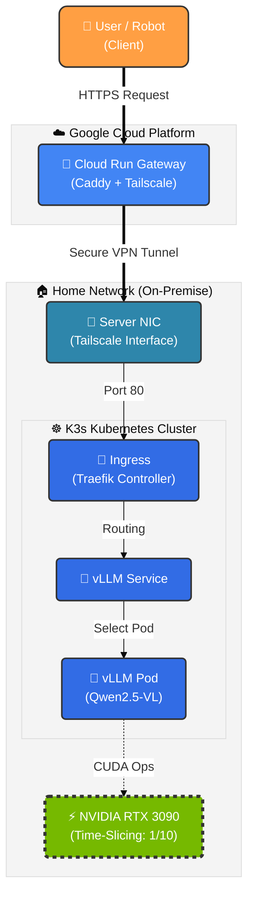

# Hybrid Cloud AI Server (RTX 3090 + GCP)

> **Low-Cost, Unlimited AI API Server powered by Home GPU** \> 로컬 GPU(RTX 3090)를 GCP Cloud Run과 Tailscale로 연결하여, 전 세계 어디서든 접속 가능한 API 서버로 구축했습니다.

## Overview

이 프로젝트는 **1인 기업의 AI 서비스 운영**를 위한 비용 효율적인 하이브리드 클라우드 아키텍처입니다.
고비용의 클라우드 GPU 인스턴스 대신 \*\*로컬 GPU(On-Premise)\*\*를 활용하며, **Cloud Run**을 게이트웨이로 사용하여 보안과 접근성을 동시에 해결했습니다.

  * **Cost Efficiency:** 유휴 상태 시 비용 $0 (Serverless). GPU 연산 비용 0원 (전기세 제외).
  * **Performance:** vLLM 엔진을 통한 SOTA급 Vision Model (Qwen2.5-VL) 서빙.
  * **Security:** 포트포워딩 없는 **Zero-Trust** VPN 터널링 (Tailscale).

-----

## Architecture




-----

## Tech Stack

| Component | Technology | Reason for Selection |
| :--- | :--- | :--- |
| **Gateway** | **GCP Cloud Run** | 완전 관리형 서버리스. 유휴 시 비용이 0원이며, 고정 IP 없이도 안정적인 HTTPS 엔드포인트 제공. |
| **Network** | **Tailscale** | 복잡한 방화벽/포트포워딩 설정 없이 NAT를 관통하는 Mesh VPN. 보안성이 뛰어남. |
| **Proxy** | **Caddy** | 설정이 간편하고 HTTPS 및 Reverse Proxy 처리가 뛰어난 경량 웹 서버. |
| **Orchestration** | **K3s** | 단일 노드 GPU 서버에 최적화된 경량 Kubernetes. 리소스 오버헤드 최소화. |
| **Inference** | **vLLM** | **Continuous Batching** 기술로 Ollama 대비 압도적인 처리량(Throughput) 제공. OpenAI API 규격 호환. |
| **Model** | **Qwen2.5-VL** | 이미지 내 좌표(Bounding Box) 인식 능력이 탁월하여 로보틱스 VLA 작업에 최적. |

-----

## Key Features

1.  **GPU Time-Slicing:** NVIDIA Device Plugin을 커스텀하여 단일 GPU를 10개의 논리적 슬롯으로 분할, 여러 AI 서비스(LLM, TTS, SD) 동시 구동 가능.
2.  **OpenAI API Compatible:** 기존 OpenAI Python SDK를 그대로 사용하여 코드 수정 없이 모델 교체 가능.
3.  **Smart Connectivity:** Cloud Run 2세대(Gen 2) 환경 튜닝을 통한 안정적인 VPN 터널링 유지.

-----

## Troubleshooting Journey (Deep Dive)

이 프로젝트를 구축하며 겪었던 주요 기술적 난관과 해결 과정을 공유합니다.

### 1\. 동적 IP 환경에서의 K3s 무한 재부팅 (CrashLoopBackOff)

  * **문제:** 가정용 인터넷(DHCP) 특성상 재부팅 시 서버 IP가 변경됨. K3s는 설정된 Node IP와 실제 IP가 불일치하면 `connection refused`를 뱉으며 실행 불가.

  * **시도:** `--node-ip` 옵션을 제거하고 자동 감지에 맡겼으나, 인터페이스 바인딩 순서 문제로 실패.

  * **해결:** 부팅 시 현재 IP를 감지하여 `systemd` 서비스 파일을 동적으로 수정하고, 꼬인 TLS 인증서를 초기화하는 **Start-up Script** 작성.

    \<details\>
    \<summary\>🛠️ 해결 스크립트 요약\</summary\>

    ```bash
    CURRENT_IP=$(ip -br addr show eno1 | awk '{print $3}' | cut -d/ -f1)
    sed -i "s|--node-ip [0-9.]*|--node-ip $CURRENT_IP|g" /etc/systemd/system/k3s.service
    rm -f /var/lib/rancher/k3s/server/tls/dynamic-cert.json
    systemctl restart k3s
    ```

    \</details\>

### 2\. Cloud Run과 Tailscale 인증 키 충돌 (Invalid Key)

  * **문제:** Cloud Run 배포 시 환경변수로 주입된 Auth Key가 `invalid key` 오류를 뱉으며 Tailscale 로그인이 거부됨.
  * **원인:** GCP Secret Manager 또는 쉘 환경변수 전달 과정에서 **보이지 않는 줄바꿈(New line)이나 공백**이 포함되어 키 값이 변조됨.
  * **해결:** `printf` 명령어를 사용하여 공백을 완전히 제거한 상태로 Secret Manager에 버전을 재등록하고, `Reusable` & `Ephemeral` 옵션을 활성화하여 키 만료 방지.

### 3\. Cloud Run Gen 2와 네트워크 장치 권한 (/dev/net/tun)

  * **문제:** 성능 향상을 위해 Cloud Run 2세대(Gen 2)를 사용했으나, `/dev/net/tun` 장치 생성 권한(`Operation not permitted`) 문제로 컨테이너 시작 실패.
  * **해결:** Kernel Mode 대신 **Userspace Networking** 모드로 전환. 대신 성능 저하를 막기 위해 `socat` 브리지 대신 **Caddy가 직접 Tailscale SOCKS5 프록시를 타도록 환경변수(`ALL_PROXY`) 튜닝**.

### 4\. 이미지 전송 시 502 Bad Gateway & Timeout

  * **문제:** 텍스트 질의는 성공하나, 고화질 이미지 전송 시 60초 후 `502` 또는 `Client Closed Request` 발생.
  * **원인:**
    1.  **MTU 이슈:** VPN 터널의 MTU(1280)보다 큰 패킷이 단편화(Fragmentation)되면서 전송 지연 발생.
    2.  **Timeout:** Cloud Run 기본 타임아웃(60초)이 거대 모델 추론 시간을 버티지 못함.
  * **해결:**
    1.  Tailscale 데몬 실행 시 `--mtu=1280` 명시.
    2.  Cloud Run 타임아웃을 \*\*300초(5분)\*\*로 확장.
    3.  **Client-side Optimization:** 이미지를 전송 전 **1024px로 리사이징**하여 페이로드 크기를 1/10로 축소.

-----

## Usage Example

OpenAI Python 라이브러리를 사용하여 로컬처럼 간편하게 호출할 수 있습니다.

```python
from openai import OpenAI
import httpx

# Cloud Run Gateway URL
client = OpenAI(
    base_url="https://your-cloud-run-url.a.run.app/v1",
    api_key="EMPTY",
    http_client=httpx.Client(timeout=300.0)
)

response = client.chat.completions.create(
    model="Qwen/Qwen2.5-VL-7B-Instruct",
    messages=[
        {"role": "user", "content": [
            {"type": "text", "text": "Describe this image for robot manipulation."},
            {"type": "image_url", "image_url": {"url": f"data:image/jpeg;base64,{base64_image}"}}
        ]}
    ],
    stream=True
)
```